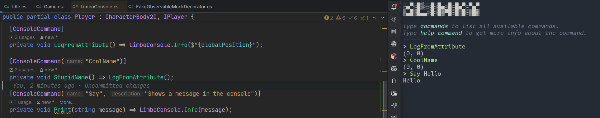

# LimboConsole.Sharp

[](https://www.nuget.org/packages/LimboConsole.Sharp)
[](LICENSE)
[](https://github.com/RcubDev/limbo_console_sharp/actions)


[](https://www.nuget.org/packages/LimboConsole.Sharp)

This nuget package is a c# wrapper that helps facilitate using the [limbo_console](https://github.com/limbonaut/limbo_console) godot plugin in c#.

## Table of Contents

- [Requirements](#️-requirements)
- [Installation](#️-installation)
- [Getting Started](#-getting-started)
- [Documentation](#-documentation)
- [Contributing](#-contributing)
- [Features](#-features)
- [Changelog](#-changelog)
- [License](#-license)
- [Contributors](#-contributors)

## ✨ Features

- **Simplified Integration**: Easily interact with the [💻 limbo_console](https://github.com/limbonaut/limbo_console) godot plugin from a c# godot game.
- **Command Registration**: [Register commands](#register-a-command) with descriptions and auto-complete sources.
- **Auto-Complete Support**: [Add auto-complete sources](#register-an-auto-complete-source) for command arguments.
- **Demo Project**: Includes examples for initialization, commands, and advanced features.

## 🛠️ Requirements

- **Godot Engine**: Version 4.4.X or higher.
- **.NET SDK**: Version 8.0
- **limbo_console plugin**: Installed and enabled in your godot project. See [💻 limbo console](https://github.com/limbonaut/limbo_console).

## 🖥️ Installation

1. Ensure the [💻 limbo console](https://github.com/limbonaut/limbo_console) plugin is installed and enabled in your godot project:
   - Go to **Project > Project Settings > Plugins** and enable the plugin.

2. Install the nuget package for your godot c# project (compatible with godot 4.4.X).

### Using `dotnet` CLI

Run the following command:

```bash
dotnet add package LimboConsole.Sharp
```

### Using csproj

Add the following line to your godot game's csproj

```cs
<PackageReference Include="LimboConsole.Sharp" Version="<specify.your.version>" />
````

## 📝 Getting started

### Register a Command

```csharp
// Access the console statically from any node within the tree
LimboConsole.RegisterCommand(new Callable(this, MethodName.StartGame), "start_game", "Starts the game");

private void StartGame() {
    // Do something
}
```

#### Using the [ConsoleCommand] Attribute

You can also use the `[ConsoleCommand]` attribute to easily define commands.

> 💡You _must_ call `RegisterConsoleCommands()` to enable your class's [ConsoleCommands].

```csharp

  // By default use name of function exactly
  [ConsoleCommand]
  private void LogFromAttribute() => LimboConsole.Info($"{GlobalPosition}");

  // Pass a custom name
  [ConsoleCommand("CoolName")]
  private void AFunctionName() => LogFromAttribute();

  // Pass a custom name and description
  [ConsoleCommand("Say", "Shows a message in the console")]
  private void Print(string message) => LimboConsole.Info(message);

  // Remember to register the commands!
  private void _Ready() {
      // This will register the commands
      RegisterConsoleCommands();
  }

```



### Register an Auto-Complete Source

You can also add auto-complete sources for command arguments:

```csharp
LimboConsole.AddArgumentAutocompleteSource("abc", 1, Callable.From(() => new string[] { "a", "b", "c" }));
```

This example adds an auto-complete source for the first argument of the `abc` command, suggesting the values `a`, `b`, or `c`.

> **Note**:  when registering an argument index starts at 1 not 0 and currently has a max of 5 arguments

#### Using the [AutoComplete] Attribute

You can also use the `[AutoComplete]` attribute to quickly define autocompletes for your attribute based console commands

> 💡You _must_ call `RegisterConsoleCommands()` to enable your class's [AutoComplete]'s!


```csharp
[ConsoleCommand]
[AutoComplete(nameof(Colors))]
public void FavoriteColorCommand(string colors) {
  // Do something
}

private string[] Colors() {
  return new [] {"red", "blue", "green"};
}
```

This example adds an auto-complete source for the first argument of the `FavoriteColorCommand` command, suggesting the values `red`, `blue`, and `green`.

### More examples

See run the demo project and see [`Demo.cs`](demo/Demo.cs) for more examples of how to use the package

## 📚 Documentation

See summary comments in nuget package or refer to [💻 limbo_console](https://github.com/limbonaut/limbo_console)

For a detailed history of changes, see the [Changelog](CHANGELOG.md).

## 🤝 Contributing

Thanks for your interest in contributing. Please follow these guidelines to keep the project consistent and maintainable in the long-term. Keep in mind this is just a wrapper. Feature or bug fixes for the requests for the console itself should go here [💻 limbo_console](https://github.com/limbonaut/limbo_console).

After a feature is added and/or the public api changes this repo will need to be updated so help keeping it up to date is appreciated!

See something you want or could improve upon? Make a PR! ✨

### Project structure

- **Limbo.Console.Sharp**: The root of the nuget package.
  - **Pack**: Use `dotnet pack` to create the package. Alternatively, run the provided `.bat` script on Windows to automate packaging to the demo project.

  > The `.bat` file is a helpful reference for understanding how the demo project and the nuget package interact. It automates the packaging process for Windows users to test changes in the demo project.

- **Demo Project**: A sample godot project included to demonstrate:
  - Registering commands and auto-complete sources.
  - Using advanced features like signals and callable commands.

> **Note**: Currently, there is no quick script for packaging on non-Windows platforms. Contributions to add this functionality are welcome!

## Code Style & Recommendations

- Follow the official [Microsoft coding conventions](https://learn.microsoft.com/en-us/dotnet/csharp/fundamentals/coding-style/coding-conventions) and [name identifiers](https://learn.microsoft.com/en-us/dotnet/csharp/fundamentals/coding-style/identifier-names)

## 📋 Changelog

See the [CHANGELOG.md](CHANGELOG.md) file for a detailed list of changes in each version.

## 📜 License

This project is licensed under the **MIT License**. See the [LICENSE](LICENSE) file for details.

## 👥 Contributors

Thanks to these wonderful people for their contributions:

[](https://github.com/ryan-linehan)
[](https://github.com/fahall)
